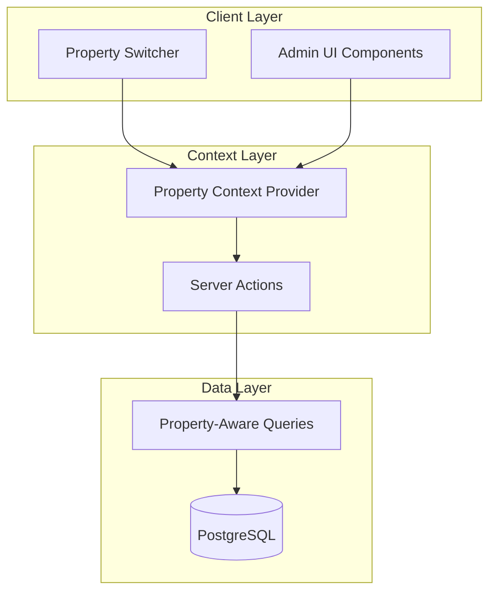
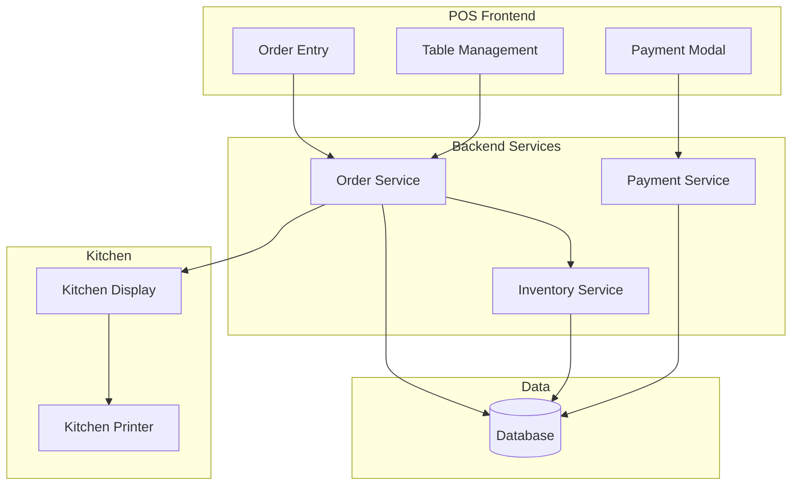
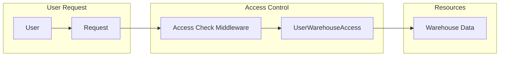

# Design Document: Enterprise Feature Gaps

## Overview

This design document outlines the architecture and implementation approach for enterprise-level features including POS System, User-Warehouse Access Control, Purchase Orders, Audit Trail, Shift Management, and supporting UI components. All features are property-aware, operating within the context of the currently selected property from the Property Switcher.

## Architecture

### Property Context Architecture



The Property Switcher stores the selected property ID in a server-side session/cookie. All server actions read this context and apply property filtering to queries.

### POS System Architecture



### Access Control Architecture



## Components and Interfaces

### Property Context Service

```typescript
// lib/property-context.ts
interface PropertyContext {
  propertyId: string | "ALL";
  isAllProperties: boolean;
}

async function getPropertyContext(): Promise<PropertyContext>;
async function setPropertyContext(propertyId: string): Promise<void>;
async function withPropertyFilter<T>(query: T): Promise<T>;
```

### User Warehouse Access Service

```typescript
// lib/inventory/user-warehouse-access.ts
interface UserWarehouseAccess {
  id: string;
  userId: string;
  warehouseId: string;
  accessLevel: "VIEW" | "MANAGE" | "ADMIN";
}

async function getUserWarehouseAccess(userId: string): Promise<UserWarehouseAccess[]>;
async function checkWarehouseAccess(userId: string, warehouseId: string, requiredLevel: AccessLevel): Promise<boolean>;
async function getAccessibleWarehouses(userId: string, propertyId: string): Promise<Warehouse[]>;
async function grantWarehouseAccess(userId: string, warehouseId: string, level: AccessLevel): Promise<UserWarehouseAccess>;
async function revokeWarehouseAccess(userId: string, warehouseId: string): Promise<void>;
```

### POS Order Service

```typescript
// lib/pos/order.ts
interface Order {
  id: string;
  orderNumber: string;
  outletId: string;
  tableId?: string;
  bookingId?: string;
  serverId: string;
  status: OrderStatus;
  items: OrderItem[];
  subtotal: Decimal;
  taxAmount: Decimal;
  serviceCharge: Decimal;
  discountAmount: Decimal;
  total: Decimal;
}

async function createOrder(outletId: string, tableId?: string, bookingId?: string): Promise<Order>;
async function addOrderItem(orderId: string, menuItemId: string, quantity: number, modifiers?: string): Promise<OrderItem>;
async function removeOrderItem(orderId: string, itemId: string): Promise<void>;
async function sendToKitchen(orderId: string): Promise<Order>;
async function applyDiscount(orderId: string, discountType: string, value: Decimal): Promise<Order>;
async function processPayment(orderId: string, payments: PaymentInput[]): Promise<Order>;
async function voidOrder(orderId: string, reason: string): Promise<Order>;
```

### Table Management Service

```typescript
// lib/pos/table.ts
interface Table {
  id: string;
  outletId: string;
  number: string;
  capacity: number;
  status: TableStatus;
  positionX?: number;
  positionY?: number;
  currentOrder?: Order;
}

async function getTables(outletId: string): Promise<Table[]>;
async function updateTableStatus(tableId: string, status: TableStatus): Promise<Table>;
async function assignServer(tableId: string, serverId: string): Promise<Table>;
async function getTableWithOrder(tableId: string): Promise<Table>;
```

### Kitchen Display Service

```typescript
// lib/pos/kitchen.ts
interface KitchenOrder {
  orderId: string;
  orderNumber: string;
  tableNumber?: string;
  items: KitchenOrderItem[];
  createdAt: Date;
  ageMinutes: number;
}

async function getKitchenOrders(outletId: string): Promise<KitchenOrder[]>;
async function markItemPreparing(itemId: string): Promise<OrderItem>;
async function markItemReady(itemId: string): Promise<OrderItem>;
async function markOrderReady(orderId: string): Promise<Order>;
```

### Purchase Order Service

```typescript
// lib/inventory/purchase-order.ts
interface PurchaseOrder {
  id: string;
  poNumber: string;
  supplierId: string;
  warehouseId: string;
  status: POStatus;
  items: PurchaseOrderItem[];
  subtotal: Decimal;
  taxAmount: Decimal;
  total: Decimal;
}

async function createPurchaseOrder(supplierId: string, warehouseId: string): Promise<PurchaseOrder>;
async function addPOItem(poId: string, stockItemId: string, quantity: Decimal, unitCost: Decimal): Promise<PurchaseOrderItem>;
async function submitForApproval(poId: string): Promise<PurchaseOrder>;
async function approvePO(poId: string, approverId: string): Promise<PurchaseOrder>;
async function rejectPO(poId: string, reason: string): Promise<PurchaseOrder>;
async function receiveAgainstPO(poId: string, items: ReceiptInput[]): Promise<POReceipt>;
async function getSuggestedPOItems(warehouseId: string): Promise<StockItem[]>;
```

### Audit Log Service

```typescript
// lib/audit/audit-log.ts
interface AuditLog {
  id: string;
  userId?: string;
  action: string;
  entityType: string;
  entityId: string;
  oldValues?: Record<string, unknown>;
  newValues?: Record<string, unknown>;
  ipAddress?: string;
  userAgent?: string;
  createdAt: Date;
}

async function logAction(params: AuditLogInput): Promise<AuditLog>;
async function getAuditLogs(filters: AuditLogFilters): Promise<AuditLog[]>;
async function getEntityHistory(entityType: string, entityId: string): Promise<AuditLog[]>;
```

### Shift Management Service

```typescript
// lib/pos/shift.ts
interface Shift {
  id: string;
  outletId: string;
  cashierId: string;
  startingCash: Decimal;
  endingCash?: Decimal;
  expectedCash?: Decimal;
  variance?: Decimal;
  status: ShiftStatus;
  openedAt: Date;
  closedAt?: Date;
}

async function openShift(outletId: string, startingCash: Decimal): Promise<Shift>;
async function closeShift(shiftId: string, endingCash: Decimal): Promise<Shift>;
async function getCurrentShift(cashierId: string): Promise<Shift | null>;
async function getShiftReport(shiftId: string): Promise<ShiftReport>;
```

### Notification Service

```typescript
// lib/notifications/notification.ts
interface Notification {
  id: string;
  userId: string;
  type: NotificationType;
  title: string;
  message: string;
  data?: Record<string, unknown>;
  isRead: boolean;
  readAt?: Date;
  createdAt: Date;
}

async function createNotification(params: NotificationInput): Promise<Notification>;
async function getUserNotifications(userId: string, unreadOnly?: boolean): Promise<Notification[]>;
async function markAsRead(notificationId: string): Promise<Notification>;
async function getUnreadCount(userId: string): Promise<number>;
```

## Data Models

### New Prisma Models

```prisma
// User-Warehouse Access Control
model UserWarehouseAccess {
  id          String      @id @default(uuid())
  userId      String
  warehouseId String
  accessLevel AccessLevel @default(VIEW)
  user        User        @relation(fields: [userId], references: [id])
  warehouse   Warehouse   @relation(fields: [warehouseId], references: [id])
  createdAt   DateTime    @default(now())
  
  @@unique([userId, warehouseId])
  @@index([userId])
  @@index([warehouseId])
}

enum AccessLevel {
  VIEW
  MANAGE
  ADMIN
}

// POS Sales Outlet
model SalesOutlet {
  id          String     @id @default(uuid())
  propertyId  String
  name        String
  type        OutletType
  warehouseId String
  isActive    Boolean    @default(true)
  property    Property   @relation(fields: [propertyId], references: [id])
  warehouse   Warehouse  @relation(fields: [warehouseId], references: [id])
  tables      Table[]
  orders      Order[]
  shifts      Shift[]
  createdAt   DateTime   @default(now())
  updatedAt   DateTime   @updatedAt
  
  @@index([propertyId])
}

enum OutletType {
  RESTAURANT
  BAR
  ROOM_SERVICE
  POOL_BAR
  CAFE
  MINIBAR
}

// Table Management
model Table {
  id        String      @id @default(uuid())
  outletId  String
  number    String
  capacity  Int
  status    TableStatus @default(AVAILABLE)
  positionX Int?
  positionY Int?
  outlet    SalesOutlet @relation(fields: [outletId], references: [id])
  orders    Order[]
  createdAt DateTime    @default(now())
  updatedAt DateTime    @updatedAt
  
  @@unique([outletId, number])
  @@index([outletId])
  @@index([status])
}

enum TableStatus {
  AVAILABLE
  OCCUPIED
  RESERVED
  DIRTY
  OUT_OF_SERVICE
}

// POS Order
model Order {
  id             String        @id @default(uuid())
  orderNumber    String        @unique
  outletId       String
  tableId        String?
  bookingId      String?
  guestId        String?
  serverId       String
  shiftId        String?
  status         OrderStatus   @default(OPEN)
  subtotal       Decimal       @db.Decimal(12, 2)
  taxAmount      Decimal       @db.Decimal(12, 2)
  serviceCharge  Decimal       @db.Decimal(12, 2) @default(0)
  discountAmount Decimal       @db.Decimal(12, 2) @default(0)
  tipAmount      Decimal       @db.Decimal(12, 2) @default(0)
  total          Decimal       @db.Decimal(12, 2)
  notes          String?
  outlet         SalesOutlet   @relation(fields: [outletId], references: [id])
  table          Table?        @relation(fields: [tableId], references: [id])
  booking        Booking?      @relation(fields: [bookingId], references: [id])
  server         User          @relation("ServerOrders", fields: [serverId], references: [id])
  shift          Shift?        @relation(fields: [shiftId], references: [id])
  items          OrderItem[]
  payments       OrderPayment[]
  createdAt      DateTime      @default(now())
  updatedAt      DateTime      @updatedAt
  
  @@index([outletId])
  @@index([status])
  @@index([createdAt])
}

enum OrderStatus {
  OPEN
  SENT_TO_KITCHEN
  IN_PROGRESS
  READY
  SERVED
  PAID
  CANCELLED
  VOID
}

// Order Line Items
model OrderItem {
  id              String          @id @default(uuid())
  orderId         String
  menuItemId      String
  quantity        Int
  unitPrice       Decimal         @db.Decimal(12, 2)
  modifiers       String?
  notes           String?
  status          OrderItemStatus @default(PENDING)
  sentToKitchenAt DateTime?
  preparedAt      DateTime?
  servedAt        DateTime?
  order           Order           @relation(fields: [orderId], references: [id], onDelete: Cascade)
  menuItem        MenuItem        @relation(fields: [menuItemId], references: [id])
  createdAt       DateTime        @default(now())
  
  @@index([orderId])
  @@index([status])
}

enum OrderItemStatus {
  PENDING
  SENT
  PREPARING
  READY
  SERVED
  CANCELLED
}

// Order Payments
model OrderPayment {
  id            String        @id @default(uuid())
  orderId       String
  amount        Decimal       @db.Decimal(12, 2)
  method        PaymentMethod
  reference     String?
  processedById String
  order         Order         @relation(fields: [orderId], references: [id], onDelete: Cascade)
  processedBy   User          @relation(fields: [processedById], references: [id])
  createdAt     DateTime      @default(now())
  
  @@index([orderId])
}

enum PaymentMethod {
  CASH
  CREDIT_CARD
  DEBIT_CARD
  ROOM_CHARGE
  VOUCHER
  COMPLIMENTARY
}

// Cashier Shift
model Shift {
  id           String      @id @default(uuid())
  outletId     String
  cashierId    String
  startingCash Decimal     @db.Decimal(12, 2)
  endingCash   Decimal?    @db.Decimal(12, 2)
  expectedCash Decimal?    @db.Decimal(12, 2)
  variance     Decimal?    @db.Decimal(12, 2)
  status       ShiftStatus @default(OPEN)
  openedAt     DateTime    @default(now())
  closedAt     DateTime?
  notes        String?
  outlet       SalesOutlet @relation(fields: [outletId], references: [id])
  cashier      User        @relation(fields: [cashierId], references: [id])
  orders       Order[]
  
  @@index([outletId])
  @@index([cashierId])
  @@index([status])
}

enum ShiftStatus {
  OPEN
  CLOSED
}

// Purchase Order
model PurchaseOrder {
  id           String              @id @default(uuid())
  poNumber     String              @unique
  propertyId   String
  supplierId   String
  warehouseId  String
  status       POStatus            @default(DRAFT)
  expectedDate DateTime?
  subtotal     Decimal             @db.Decimal(12, 2)
  taxAmount    Decimal             @db.Decimal(12, 2) @default(0)
  total        Decimal             @db.Decimal(12, 2)
  notes        String?
  createdById  String
  approvedById String?
  approvedAt   DateTime?
  sentAt       DateTime?
  property     Property            @relation(fields: [propertyId], references: [id])
  supplier     Supplier            @relation(fields: [supplierId], references: [id])
  warehouse    Warehouse           @relation(fields: [warehouseId], references: [id])
  createdBy    User                @relation("POCreatedBy", fields: [createdById], references: [id])
  approvedBy   User?               @relation("POApprovedBy", fields: [approvedById], references: [id])
  items        PurchaseOrderItem[]
  receipts     POReceipt[]
  createdAt    DateTime            @default(now())
  updatedAt    DateTime            @updatedAt
  
  @@index([propertyId])
  @@index([status])
}

enum POStatus {
  DRAFT
  PENDING_APPROVAL
  APPROVED
  SENT
  PARTIALLY_RECEIVED
  RECEIVED
  CLOSED
  CANCELLED
}

model PurchaseOrderItem {
  id              String        @id @default(uuid())
  purchaseOrderId String
  stockItemId     String
  quantity        Decimal       @db.Decimal(12, 4)
  unitCost        Decimal       @db.Decimal(12, 4)
  receivedQty     Decimal       @db.Decimal(12, 4) @default(0)
  purchaseOrder   PurchaseOrder @relation(fields: [purchaseOrderId], references: [id], onDelete: Cascade)
  stockItem       StockItem     @relation(fields: [stockItemId], references: [id])
  
  @@index([purchaseOrderId])
}

// PO Receipt
model POReceipt {
  id              String          @id @default(uuid())
  purchaseOrderId String
  receivedById    String
  notes           String?
  purchaseOrder   PurchaseOrder   @relation(fields: [purchaseOrderId], references: [id])
  receivedBy      User            @relation(fields: [receivedById], references: [id])
  items           POReceiptItem[]
  createdAt       DateTime        @default(now())
  
  @@index([purchaseOrderId])
}

model POReceiptItem {
  id             String    @id @default(uuid())
  poReceiptId    String
  stockItemId    String
  quantity       Decimal   @db.Decimal(12, 4)
  batchNumber    String?
  expirationDate DateTime?
  poReceipt      POReceipt @relation(fields: [poReceiptId], references: [id], onDelete: Cascade)
  stockItem      StockItem @relation(fields: [stockItemId], references: [id])
  
  @@index([poReceiptId])
}

// Audit Log
model AuditLog {
  id         String   @id @default(uuid())
  userId     String?
  action     String
  entityType String
  entityId   String
  oldValues  Json?
  newValues  Json?
  ipAddress  String?
  userAgent  String?
  user       User?    @relation(fields: [userId], references: [id])
  createdAt  DateTime @default(now())
  
  @@index([entityType, entityId])
  @@index([userId])
  @@index([createdAt])
}

// Notification
model Notification {
  id        String           @id @default(uuid())
  userId    String
  type      NotificationType
  title     String
  message   String
  data      Json?
  isRead    Boolean          @default(false)
  readAt    DateTime?
  user      User             @relation(fields: [userId], references: [id])
  createdAt DateTime         @default(now())
  
  @@index([userId, isRead])
  @@index([createdAt])
}

enum NotificationType {
  LOW_STOCK
  PO_APPROVAL
  REQUISITION_STATUS
  CYCLE_COUNT_REMINDER
  EXPIRING_BATCH
  ORDER_READY
  SYSTEM
}
```

## Correctness Properties

*A property is a characteristic or behavior that should hold true across all valid executions of a system—essentially, a formal statement about what the system should do. Properties serve as the bridge between human-readable specifications and machine-verifiable correctness guarantees.*

### Property 1: Property Scope Filtering

*For any* data query executed while a user has a specific property selected, all returned records SHALL belong to that property (or have a valid relationship to that property).

**Validates: Requirements 1.1, 1.2, 3.4**

### Property 2: Super Admin All Properties Access

*For any* super admin user with "All Properties" selected, data queries SHALL return the union of all records across all properties.

**Validates: Requirements 1.3**

### Property 3: Warehouse Access Level Enforcement

*For any* user with a specific access level (VIEW, MANAGE, ADMIN) on a warehouse, the system SHALL permit exactly the operations allowed for that level and deny all others.

**Validates: Requirements 2.2, 2.3, 2.4**

### Property 4: Warehouse Access Filtering

*For any* user querying warehouses, the returned list SHALL contain only warehouses where the user has at least VIEW access (or all warehouses if super admin).

**Validates: Requirements 2.5, 2.6**

### Property 5: Table Status Workflow Integrity

*For any* table, status transitions SHALL follow the valid workflow: creating an order sets OCCUPIED, paying sets DIRTY, cleaning sets AVAILABLE.

**Validates: Requirements 4.3, 4.4, 4.5**

### Property 6: Order Total Calculation Consistency

*For any* order, the total SHALL equal subtotal + taxAmount + serviceCharge - discountAmount + tipAmount, and subtotal SHALL equal the sum of (item.quantity × item.unitPrice) for all items.

**Validates: Requirements 5.2, 5.4**

### Property 7: Split Payment Integrity

*For any* order with split payments, the sum of all OrderPayment amounts SHALL equal the order total.

**Validates: Requirements 5.5, 7.4**

### Property 8: Order Status Progression

*For any* order, status transitions SHALL follow valid paths: OPEN → SENT_TO_KITCHEN → IN_PROGRESS → READY → SERVED → PAID, with CANCELLED/VOID as terminal states from any non-PAID state.

**Validates: Requirements 5.3, 6.5, 7.5**

### Property 9: Menu Item Availability Enforcement

*For any* menu item marked as unavailable, attempts to add it to an order SHALL be rejected.

**Validates: Requirements 5.6**

### Property 10: Room Charge Booking Validation

*For any* room charge payment, the associated booking SHALL have status CONFIRMED and the guest SHALL be authorized for room charges.

**Validates: Requirements 8.1, 8.2**

### Property 11: Room Charge Folio Consistency

*For any* room charge processed, the booking's total charges SHALL increase by exactly the order total amount.

**Validates: Requirements 8.3**

### Property 12: Purchase Order Number Uniqueness

*For any* two purchase orders, their PO numbers SHALL be unique across the entire system.

**Validates: Requirements 9.1**

### Property 13: PO Status Workflow Integrity

*For any* purchase order, status transitions SHALL follow: DRAFT → PENDING_APPROVAL → APPROVED → SENT → (PARTIALLY_RECEIVED | RECEIVED) → CLOSED, with CANCELLED as terminal from non-RECEIVED states.

**Validates: Requirements 9.2, 9.3, 9.5, 9.6**

### Property 14: PO Receiving Quantity Consistency

*For any* PO item, the receivedQty SHALL equal the sum of quantities from all POReceiptItems for that item, and SHALL NOT exceed the ordered quantity.

**Validates: Requirements 9.4**

### Property 15: Category Deletion Protection

*For any* stock category with associated stock items, deletion attempts SHALL be rejected.

**Validates: Requirements 11.5**

### Property 16: Audit Log Completeness

*For any* inventory operation (create, update, delete), an AuditLog record SHALL be created with the correct action, entity type, entity ID, and user ID.

**Validates: Requirements 12.1**

### Property 17: Audit Log Value Capture

*For any* update operation, the AuditLog SHALL contain the old values before the update and new values after the update.

**Validates: Requirements 12.2**

### Property 18: Shift Cash Variance Calculation

*For any* closed shift, the variance SHALL equal endingCash - expectedCash, where expectedCash equals startingCash plus all cash payments minus cash refunds during the shift.

**Validates: Requirements 13.3, 13.4**

### Property 19: Shift Order Association

*For any* order created while a cashier has an open shift, the order SHALL be associated with that shift.

**Validates: Requirements 13.2**

### Property 20: Notification Creation on Events

*For any* triggering event (low stock, PO approval needed, requisition status change, expiring batch), a notification SHALL be created for the appropriate users.

**Validates: Requirements 15.1, 15.2, 15.3, 15.4**

### Property 21: Notification Read State

*For any* notification marked as read, the isRead flag SHALL be true and readAt SHALL contain the timestamp of when it was read.

**Validates: Requirements 15.6**

### Property 22: Bulk Import Atomicity

*For any* bulk import operation with validation errors, no records SHALL be created and all errors SHALL be reported.

**Validates: Requirements 17.4**

## Error Handling

### Property Context Errors
- **PropertyNotSelected**: User must select a property before accessing property-scoped data
- **PropertyAccessDenied**: User does not have access to the requested property

### Warehouse Access Errors
- **WarehouseAccessDenied**: User lacks required access level for the operation
- **WarehouseNotFound**: Warehouse does not exist or user has no access

### POS Errors
- **OutletInactive**: Cannot create orders for inactive outlets
- **TableOccupied**: Cannot create order for already occupied table
- **MenuItemUnavailable**: Cannot add unavailable item to order
- **OrderAlreadyPaid**: Cannot modify paid orders
- **InvalidPaymentAmount**: Payment amounts do not match order total
- **NoOpenShift**: Cashier must have open shift to process orders

### Room Charge Errors
- **BookingNotFound**: No active booking for room charge
- **BookingNotConfirmed**: Booking must be confirmed for room charges
- **GuestNotAuthorized**: Guest not authorized for room charges

### Purchase Order Errors
- **PONotEditable**: Cannot modify PO in current status
- **ReceiveExceedsOrdered**: Cannot receive more than ordered quantity
- **SupplierInactive**: Cannot create PO for inactive supplier

### Audit Errors
- **AuditLogFailed**: Failed to create audit log (should not block operation)

## Testing Strategy

### Unit Tests
- Test individual service functions with mocked dependencies
- Test validation logic for all input types
- Test error handling for edge cases
- Test calculation functions (totals, variance, etc.)

### Property-Based Tests
Using fast-check for TypeScript property-based testing:

1. **Property Scope Filtering Test** (Property 1)
   - Generate random property IDs and data records
   - Verify all returned records match the selected property

2. **Access Level Enforcement Test** (Property 3)
   - Generate random users with various access levels
   - Verify operations succeed/fail based on access level

3. **Order Total Calculation Test** (Property 6)
   - Generate random order items with prices and quantities
   - Verify total calculation is always correct

4. **Split Payment Integrity Test** (Property 7)
   - Generate random split payment configurations
   - Verify sum always equals order total

5. **PO Receiving Consistency Test** (Property 14)
   - Generate random receiving sequences
   - Verify receivedQty never exceeds ordered quantity

6. **Shift Variance Calculation Test** (Property 18)
   - Generate random shift transactions
   - Verify variance calculation is always correct

7. **Bulk Import Atomicity Test** (Property 22)
   - Generate random import data with some invalid records
   - Verify no records created when errors exist

### Integration Tests
- Test complete workflows (order creation → payment → shift close)
- Test property context switching
- Test notification delivery
- Test audit log creation across operations

### Configuration
- Minimum 100 iterations per property test
- Tag format: **Feature: enterprise-gaps, Property {number}: {property_text}**
