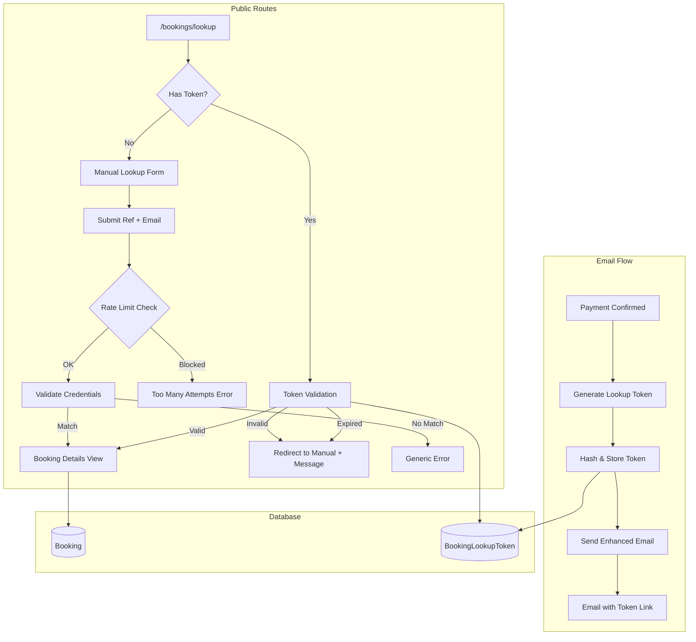

# Design Document: Guest Booking Lookup

## Overview

This design implements a secure guest booking lookup system that allows guests who completed checkout without creating an account to view their booking details. The system provides two access methods: manual lookup via reference + email verification, and direct access via a secure token link embedded in confirmation emails.

## Architecture



## Components and Interfaces

### 1. Booking Lookup Token Model (Prisma)

```prisma
model BookingLookupToken {
    id          String   @id @default(uuid())
    bookingId   String
    booking     Booking  @relation(fields: [bookingId], references: [id], onDelete: Cascade)
    tokenHash   String   @unique  // SHA-256 hash of the token
    expiresAt   DateTime
    createdAt   DateTime @default(now())
    
    @@index([bookingId])
    @@index([expiresAt])
}
```

### 2. Lookup Token Service (`lib/booking/lookup-token.ts`)

```typescript
interface LookupTokenService {
  // Generate a new lookup token for a booking
  generateToken(bookingId: string): Promise<{ token: string; expiresAt: Date }>;
  
  // Validate a token and return booking ID if valid
  validateToken(token: string): Promise<{ valid: boolean; bookingId?: string; expired?: boolean }>;
  
  // Hash a token for storage
  hashToken(token: string): string;
}
```

### 3. Booking Lookup Service (`lib/booking/lookup.ts`)

```typescript
interface BookingLookupService {
  // Look up booking by reference and email
  lookupByCredentials(shortRef: string, email: string): Promise<BookingDetails | null>;
  
  // Look up booking by valid token
  lookupByToken(token: string): Promise<{ booking: BookingDetails | null; expired: boolean }>;
  
  // Get full booking details for display
  getBookingDetails(bookingId: string): Promise<BookingDetails>;
}

interface BookingDetails {
  id: string;
  shortRef: string;
  status: BookingStatus;
  paymentStatus: PaymentStatus;
  guestFirstName: string;
  guestLastName: string;
  guestEmail: string;
  guestPhone: string;
  totalAmount: number;
  taxAmount: number;
  serviceCharge: number;
  property: { name: string; location: string } | null;
  items: BookingItemDetails[];
  policies: PropertyPolicy[];
}
```

### 4. Rate Limiter (`lib/rate-limit.ts`)

```typescript
interface RateLimiter {
  // Check if request should be rate limited
  checkLimit(identifier: string, limit: number, windowMs: number): Promise<{ allowed: boolean; remaining: number }>;
}
```

### 5. Server Actions (`actions/booking-lookup.ts`)

```typescript
// Manual lookup action
async function lookupBooking(shortRef: string, email: string): Promise<LookupResult>;

// Token-based lookup action  
async function lookupBookingByToken(token: string): Promise<TokenLookupResult>;
```

### 6. Page Components

- `app/(public)/bookings/lookup/page.tsx` - Main lookup page with form
- `app/(public)/bookings/lookup/[token]/page.tsx` - Token-based direct access route
- `components/booking/LookupForm.tsx` - Client component for lookup form
- `components/booking/BookingDetailsCard.tsx` - Reusable booking details display

## Data Models

### BookingLookupToken

| Field | Type | Description |
|-------|------|-------------|
| id | UUID | Primary key |
| bookingId | UUID | Foreign key to Booking |
| tokenHash | String | SHA-256 hash of the plain token |
| expiresAt | DateTime | Token expiration (createdAt + 30 days) |
| createdAt | DateTime | Token creation timestamp |

### Token Format

- Plain token: 32-character URL-safe base64 string (256 bits of entropy)
- Stored as: SHA-256 hash of plain token
- URL format: `/bookings/lookup/{token}`

## Correctness Properties

*A property is a characteristic or behavior that should hold true across all valid executions of a system—essentially, a formal statement about what the system should do. Properties serve as the bridge between human-readable specifications and machine-verifiable correctness guarantees.*

### Property 1: Lookup Credential Validation

*For any* booking in the database and *for any* email address, the lookup function returns the booking details if and only if the email matches the booking's guestEmail (case-insensitive comparison).

**Validates: Requirements 1.2, 1.3**

### Property 2: Error Message Uniformity

*For any* lookup attempt that fails (whether due to non-existent reference, wrong email, or invalid format), the error message returned is identical, preventing information leakage about which bookings exist.

**Validates: Requirements 1.3, 1.4**

### Property 3: Booking Details Completeness

*For any* successful booking lookup (via credentials or token), the returned BookingDetails object contains all required fields: shortRef, status, paymentStatus, property name, room details, check-in/check-out dates, guest count, and total amount.

**Validates: Requirements 1.6, 2.1**

### Property 4: Token Generation Security

*For any* generated lookup token, the token has at least 256 bits of entropy and is generated using a cryptographically secure random number generator.

**Validates: Requirements 4.1**

### Property 5: Token Storage Round-Trip

*For any* generated token, hashing the token and storing it, then later validating the same plain token against the stored hash, returns a successful validation result.

**Validates: Requirements 4.2, 4.3**

### Property 6: Token Expiration Enforcement

*For any* lookup token, if the current time is greater than the token's expiresAt timestamp, the validation function returns `{ valid: false, expired: true }`.

**Validates: Requirements 3.2, 4.4**

### Property 7: Rate Limiting Enforcement

*For any* IP address making lookup requests, after 5 failed attempts within a 60-second window, subsequent requests are blocked until the window resets.

**Validates: Requirements 4.5**

### Property 8: Token-Based Access Bypass

*For any* valid (non-expired) lookup token, accessing the booking via token does not require email verification and returns the full booking details.

**Validates: Requirements 3.3**

## Error Handling

| Scenario | Response | HTTP Status |
|----------|----------|-------------|
| Empty reference or email | Validation error with field indicators | 400 |
| Invalid credentials (any reason) | "Booking not found. Please check your reference number and email." | 404 |
| Rate limited | "Too many attempts. Please try again in a minute." | 429 |
| Expired token | Redirect to `/bookings/lookup?expired=true` | 302 |
| Invalid token format | Redirect to `/bookings/lookup` | 302 |
| Server error | "Something went wrong. Please try again." | 500 |

## Testing Strategy

### Unit Tests

- Token generation produces valid format
- Token hashing is deterministic
- Email comparison is case-insensitive
- Rate limiter correctly tracks attempts
- Booking details serialization includes all fields

### Property-Based Tests

Using `fast-check` for property-based testing:

1. **Credential validation property**: Generate random bookings and emails, verify lookup behavior
2. **Error uniformity property**: Generate various invalid inputs, verify identical error messages
3. **Token round-trip property**: Generate tokens, hash, validate, verify success
4. **Expiration property**: Generate tokens with various expiration times, verify enforcement
5. **Rate limiting property**: Simulate rapid requests, verify blocking after threshold

### Integration Tests

- Full lookup flow with database
- Email sending with token link
- Token-based access redirect flow
- Rate limiting across requests

## Security Considerations

1. **Token Entropy**: 256-bit tokens provide sufficient randomness to prevent guessing
2. **Hash Storage**: Only hashes stored in DB; plain tokens never persisted
3. **Rate Limiting**: Prevents brute-force enumeration of booking references
4. **Generic Errors**: Identical error messages prevent information disclosure
5. **Token Expiration**: 30-day limit reduces window for token compromise
6. **HTTPS Only**: Token links only work over HTTPS in production
