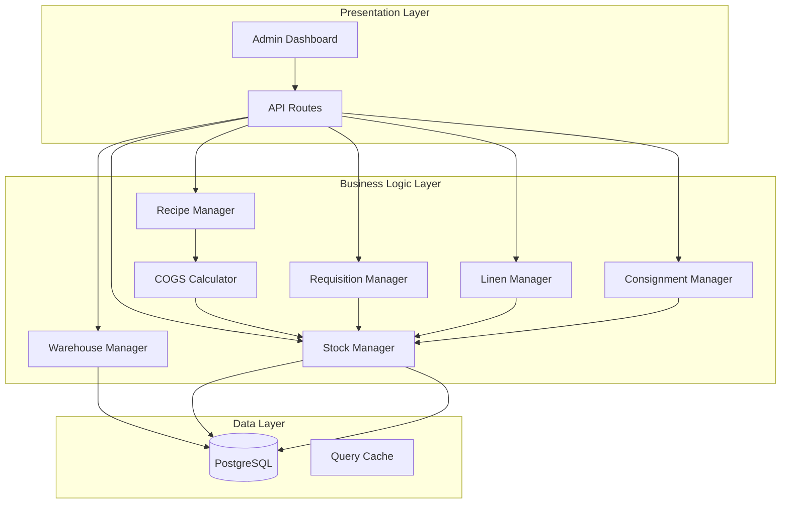

# Design Document: Inventory & Restaurant Management System

## Overview

This design describes a comprehensive inventory management system for hotel operations, integrating multi-warehouse stock control, restaurant recipe management with COGS tracking, linen lifecycle management, and consignment product handling. The system follows a modular architecture that integrates with the existing Next.js/Prisma hotel management application.

## Architecture



### Key Design Decisions

1. **Weighted Average Costing**: Stock costs use weighted average method for simplicity and GAAP compliance
2. **Atomic Transfers**: All inter-warehouse transfers use database transactions to ensure consistency
3. **Soft Deletes**: Critical records use soft deletes to preserve audit trails
4. **Property Scoping**: All inventory is scoped to a Property for multi-property support
5. **Server Actions**: Use Next.js Server Actions for mutations, maintaining existing patterns

## Components and Interfaces

### 1. Warehouse Manager

```typescript
interface Warehouse {
  id: string;
  propertyId: string;
  name: string;
  type: WarehouseType;
  isActive: boolean;
  createdAt: Date;
  updatedAt: Date;
}

enum WarehouseType {
  MAIN_STOCKROOM = "MAIN_STOCKROOM",
  KITCHEN = "KITCHEN",
  HOUSEKEEPING = "HOUSEKEEPING",
  BAR = "BAR",
  MINIBAR = "MINIBAR"
}

interface WarehouseService {
  create(data: CreateWarehouseInput): Promise<Warehouse>;
  getById(id: string): Promise<Warehouse | null>;
  getByProperty(propertyId: string): Promise<Warehouse[]>;
  update(id: string, data: UpdateWarehouseInput): Promise<Warehouse>;
  deactivate(id: string): Promise<Warehouse>;
}
```

### 2. Stock Item Catalog

```typescript
interface StockItem {
  id: string;
  propertyId: string;
  name: string;
  sku: string;
  category: StockCategory;
  primaryUnitId: string;
  isConsignment: boolean;
  supplierId?: string;
  parLevel?: number;
  isActive: boolean;
  createdAt: Date;
  updatedAt: Date;
}

enum StockCategory {
  INGREDIENT = "INGREDIENT",
  LINEN = "LINEN",
  CONSUMABLE = "CONSUMABLE",
  CONSIGNMENT = "CONSIGNMENT",
  EQUIPMENT = "EQUIPMENT"
}

interface UnitOfMeasure {
  id: string;
  name: string;           // "Kilogram", "Gram", "Piece"
  abbreviation: string;   // "kg", "g", "pc"
  baseUnitId?: string;    // Reference to base unit for conversions
  conversionFactor: number; // 1 kg = 1000 (grams as base)
}

interface StockItemService {
  create(data: CreateStockItemInput): Promise<StockItem>;
  getById(id: string): Promise<StockItem | null>;
  search(query: StockSearchQuery): Promise<StockItem[]>;
  update(id: string, data: UpdateStockItemInput): Promise<StockItem>;
  getStockLevel(itemId: string, warehouseId: string): Promise<StockLevel>;
  getLowStockItems(propertyId: string): Promise<LowStockAlert[]>;
}
```

### 3. Stock Movement Manager

```typescript
interface StockMovement {
  id: string;
  stockItemId: string;
  warehouseId: string;
  batchId?: string;
  type: MovementType;
  quantity: number;
  unitCost?: number;
  totalCost?: number;
  referenceType?: string;  // "REQUISITION", "RECIPE_PRODUCTION", "ADJUSTMENT", "WASTE"
  referenceId?: string;
  reason?: string;
  createdById: string;
  createdAt: Date;
}

enum MovementType {
  RECEIPT = "RECEIPT",
  TRANSFER_IN = "TRANSFER_IN",
  TRANSFER_OUT = "TRANSFER_OUT",
  CONSUMPTION = "CONSUMPTION",
  ADJUSTMENT = "ADJUSTMENT",
  RETURN = "RETURN",
  WASTE = "WASTE"
}

interface StockLevel {
  stockItemId: string;
  warehouseId: string;
  quantity: number;
  averageCost: number;
  totalValue: number;
  lastMovementAt: Date;
}

interface StockMovementService {
  receiveStock(data: ReceiveStockInput): Promise<StockMovement>;
  transferStock(data: TransferStockInput): Promise<{ out: StockMovement; in: StockMovement }>;
  consumeStock(data: ConsumeStockInput): Promise<StockMovement>;
  adjustStock(data: AdjustStockInput): Promise<StockMovement>;
  getMovementHistory(query: MovementHistoryQuery): Promise<StockMovement[]>;
  calculateAverageCost(stockItemId: string, warehouseId: string): Promise<number>;
}
```

### 3.1 Batch/Lot Manager

```typescript
interface StockBatch {
  id: string;
  stockItemId: string;
  warehouseId: string;
  batchNumber: string;
  quantity: number;
  unitCost: number;
  expirationDate?: Date;
  receivedAt: Date;
  isExpired: boolean;
}

interface ExpirationAlert {
  batchId: string;
  stockItemId: string;
  stockItemName: string;
  warehouseId: string;
  warehouseName: string;
  batchNumber: string;
  quantity: number;
  expirationDate: Date;
  daysUntilExpiration: number;
}

interface BatchService {
  createBatch(data: CreateBatchInput): Promise<StockBatch>;
  getBatchesByItem(stockItemId: string, warehouseId: string): Promise<StockBatch[]>;
  getExpiringBatches(warehouseId: string, daysThreshold: number): Promise<ExpirationAlert[]>;
  markExpired(batchId: string): Promise<StockBatch>;
  consumeFromBatch(batchId: string, quantity: number): Promise<StockMovement>;
  getNextBatchFEFO(stockItemId: string, warehouseId: string): Promise<StockBatch | null>;
}
```

### 3.2 Waste Manager

```typescript
interface WasteRecord {
  id: string;
  stockItemId: string;
  warehouseId: string;
  batchId?: string;
  wasteType: WasteType;
  quantity: number;
  unitCost: number;
  totalCost: number;
  reason?: string;
  recordedById: string;
  createdAt: Date;
}

enum WasteType {
  SPOILAGE = "SPOILAGE",
  EXPIRED = "EXPIRED",
  DAMAGED = "DAMAGED",
  OVERPRODUCTION = "OVERPRODUCTION",
  PREPARATION_WASTE = "PREPARATION_WASTE"
}

interface WasteReport {
  periodStart: Date;
  periodEnd: Date;
  totalWasteCost: number;
  totalConsumptionCost: number;
  wastePercentage: number;
  byType: { type: WasteType; cost: number; quantity: number }[];
  byItem: { stockItemId: string; name: string; cost: number; quantity: number }[];
}

interface WasteService {
  recordWaste(data: RecordWasteInput): Promise<WasteRecord>;
  getWasteHistory(query: WasteHistoryQuery): Promise<WasteRecord[]>;
  generateWasteReport(warehouseId: string, periodStart: Date, periodEnd: Date): Promise<WasteReport>;
  calculateWastePercentage(warehouseId: string, periodStart: Date, periodEnd: Date): Promise<number>;
}
```

### 4. Requisition Manager

```typescript
interface Requisition {
  id: string;
  requestingWarehouseId: string;
  sourceWarehouseId: string;
  status: RequisitionStatus;
  requestedById: string;
  approvedById?: string;
  items: RequisitionItem[];
  notes?: string;
  createdAt: Date;
  updatedAt: Date;
}

enum RequisitionStatus {
  PENDING = "PENDING",
  APPROVED = "APPROVED",
  PARTIALLY_FULFILLED = "PARTIALLY_FULFILLED",
  FULFILLED = "FULFILLED",
  REJECTED = "REJECTED"
}

interface RequisitionItem {
  id: string;
  requisitionId: string;
  stockItemId: string;
  requestedQuantity: number;
  fulfilledQuantity: number;
  unitId: string;
}

interface RequisitionService {
  create(data: CreateRequisitionInput): Promise<Requisition>;
  approve(id: string, approverId: string): Promise<Requisition>;
  reject(id: string, approverId: string, reason: string): Promise<Requisition>;
  fulfill(id: string, items: FulfillmentItem[]): Promise<Requisition>;
  getByWarehouse(warehouseId: string, status?: RequisitionStatus): Promise<Requisition[]>;
}
```

### 5. Recipe Manager

```typescript
interface Recipe {
  id: string;
  name: string;
  description?: string;
  yield: number;           // Number of portions
  yieldUnitId: string;
  ingredients: RecipeIngredient[];
  subRecipes: RecipeSubRecipe[];
  instructions?: string;
  prepTimeMinutes?: number;
  cookTimeMinutes?: number;
  isActive: boolean;
  createdAt: Date;
  updatedAt: Date;
}

interface RecipeIngredient {
  id: string;
  recipeId: string;
  stockItemId: string;
  quantity: number;
  unitId: string;
  notes?: string;
}

interface RecipeSubRecipe {
  id: string;
  parentRecipeId: string;
  childRecipeId: string;
  quantity: number;  // How many portions of sub-recipe needed
}

interface RecipeService {
  create(data: CreateRecipeInput): Promise<Recipe>;
  getById(id: string): Promise<Recipe | null>;
  update(id: string, data: UpdateRecipeInput): Promise<Recipe>;
  calculateCost(recipeId: string, warehouseId: string): Promise<RecipeCost>;
  checkAvailability(recipeId: string, warehouseId: string, portions: number): Promise<AvailabilityResult>;
  produceRecipe(recipeId: string, warehouseId: string, portions: number): Promise<ProductionResult>;
}
```

### 6. COGS Calculator

```typescript
interface RecipeCost {
  recipeId: string;
  totalCost: number;
  costPerPortion: number;
  ingredientCosts: IngredientCost[];
  subRecipeCosts: SubRecipeCost[];
  calculatedAt: Date;
}

interface IngredientCost {
  stockItemId: string;
  stockItemName: string;
  quantity: number;
  unitCost: number;
  totalCost: number;
}

interface MenuItemProfitability {
  menuItemId: string;
  sellingPrice: number;
  recipeCost: number;
  grossProfit: number;
  foodCostPercentage: number;
  isAboveTargetCost: boolean;
}

interface COGSCalculator {
  calculateRecipeCost(recipe: Recipe, warehouseId: string): Promise<RecipeCost>;
  calculateMenuItemProfitability(menuItemId: string): Promise<MenuItemProfitability>;
  getWeightedAverageCost(stockItemId: string, warehouseId: string): Promise<number>;
  recordSaleCOGS(menuItemId: string, quantity: number, warehouseId: string): Promise<COGSRecord>;
}
```

### 7. Menu Item Manager

```typescript
interface MenuItem {
  id: string;
  propertyId: string;
  name: string;
  description?: string;
  category: MenuCategory;
  sellingPrice: number;
  recipeId?: string;
  isAvailable: boolean;
  unavailableReason?: string;
  image?: string;
  createdAt: Date;
  updatedAt: Date;
}

enum MenuCategory {
  APPETIZER = "APPETIZER",
  MAIN_COURSE = "MAIN_COURSE",
  DESSERT = "DESSERT",
  BEVERAGE = "BEVERAGE",
  SIDE_DISH = "SIDE_DISH"
}

interface MenuItemService {
  create(data: CreateMenuItemInput): Promise<MenuItem>;
  getById(id: string): Promise<MenuItem | null>;
  getByProperty(propertyId: string): Promise<MenuItem[]>;
  update(id: string, data: UpdateMenuItemInput): Promise<MenuItem>;
  checkAvailability(id: string): Promise<boolean>;
  setUnavailable(id: string, reason: string): Promise<MenuItem>;
}
```

### 8. Linen Manager

```typescript
interface LinenItem {
  id: string;
  stockItemId: string;
  serialNumber?: string;
  type: LinenType;
  size?: string;
  condition: LinenCondition;
  status: LinenStatus;
  warehouseId: string;
  assignedRoomId?: string;
  purchaseDate?: Date;
  lastLaundryDate?: Date;
  cycleCount: number;
  createdAt: Date;
  updatedAt: Date;
}

enum LinenType {
  BED_SHEET = "BED_SHEET",
  PILLOW_CASE = "PILLOW_CASE",
  DUVET_COVER = "DUVET_COVER",
  TOWEL = "TOWEL",
  BATH_MAT = "BATH_MAT",
  BLANKET = "BLANKET"
}

enum LinenStatus {
  IN_STOCK = "IN_STOCK",
  IN_USE = "IN_USE",
  IN_LAUNDRY = "IN_LAUNDRY",
  DAMAGED = "DAMAGED",
  RETIRED = "RETIRED"
}

enum LinenCondition {
  NEW = "NEW",
  GOOD = "GOOD",
  FAIR = "FAIR",
  POOR = "POOR"
}

interface LinenService {
  issueToRoom(itemIds: string[], roomId: string): Promise<LinenItem[]>;
  returnFromRoom(itemIds: string[], condition: LinenCondition): Promise<LinenItem[]>;
  sendToLaundry(itemIds: string[]): Promise<LinenItem[]>;
  receiveFromLaundry(itemIds: string[]): Promise<LinenItem[]>;
  markDamaged(itemId: string, damageType: string): Promise<LinenItem>;
  retire(itemId: string, reason: string): Promise<LinenItem>;
  getParLevelReport(propertyId: string): Promise<LinenParReport>;
}
```

### 9. Consignment Manager

```typescript
interface ConsignmentReceipt {
  id: string;
  supplierId: string;
  warehouseId: string;
  items: ConsignmentReceiptItem[];
  receivedById: string;
  receivedAt: Date;
  notes?: string;
}

interface ConsignmentReceiptItem {
  id: string;
  receiptId: string;
  stockItemId: string;
  quantity: number;
  sellingPrice: number;
  supplierCost: number;
}

interface ConsignmentSale {
  id: string;
  stockItemId: string;
  quantity: number;
  sellingPrice: number;
  supplierCost: number;
  soldAt: Date;
  settledAt?: Date;
}

interface ConsignmentSettlement {
  id: string;
  supplierId: string;
  periodStart: Date;
  periodEnd: Date;
  totalSales: number;
  totalSupplierDue: number;
  items: ConsignmentSettlementItem[];
  settledAt?: Date;
}

interface ConsignmentService {
  receiveConsignment(data: ReceiveConsignmentInput): Promise<ConsignmentReceipt>;
  recordSale(stockItemId: string, quantity: number): Promise<ConsignmentSale>;
  returnToSupplier(data: ReturnConsignmentInput): Promise<ConsignmentReturn>;
  generateSettlement(supplierId: string, periodStart: Date, periodEnd: Date): Promise<ConsignmentSettlement>;
  getUnsettledSales(supplierId: string): Promise<ConsignmentSale[]>;
}
```

## Data Models

### Prisma Schema Extensions

```prisma
// Warehouse Management
model Warehouse {
  id         String        @id @default(uuid())
  propertyId String
  property   Property      @relation(fields: [propertyId], references: [id])
  name       String
  type       WarehouseType
  isActive   Boolean       @default(true)
  
  stockLevels    StockLevel[]
  stockBatches   StockBatch[]
  movementsFrom  StockMovement[] @relation("SourceWarehouse")
  movementsTo    StockMovement[] @relation("DestinationWarehouse")
  requisitionsFrom Requisition[] @relation("RequestingWarehouse")
  requisitionsTo   Requisition[] @relation("SourceWarehouse")
  linens         LinenItem[]
  wasteRecords   WasteRecord[]
  
  createdAt DateTime @default(now())
  updatedAt DateTime @updatedAt
  
  @@unique([propertyId, name])
  @@index([propertyId])
}

enum WarehouseType {
  MAIN_STOCKROOM
  KITCHEN
  HOUSEKEEPING
  BAR
  MINIBAR
}

// Stock Item Catalog
model StockItem {
  id            String        @id @default(uuid())
  propertyId    String
  property      Property      @relation(fields: [propertyId], references: [id])
  name          String
  sku           String
  category      StockCategory
  primaryUnitId String
  primaryUnit   UnitOfMeasure @relation(fields: [primaryUnitId], references: [id])
  isConsignment Boolean       @default(false)
  supplierId    String?
  supplier      Supplier?     @relation(fields: [supplierId], references: [id])
  isActive      Boolean       @default(true)
  
  stockLevels       StockLevel[]
  stockBatches      StockBatch[]
  movements         StockMovement[]
  recipeIngredients RecipeIngredient[]
  parLevels         StockParLevel[]
  linens            LinenItem[]
  consignmentItems  ConsignmentReceiptItem[]
  wasteRecords      WasteRecord[]
  
  createdAt DateTime @default(now())
  updatedAt DateTime @updatedAt
  
  @@unique([propertyId, sku])
  @@index([propertyId])
  @@index([category])
}

enum StockCategory {
  INGREDIENT
  LINEN
  CONSUMABLE
  CONSIGNMENT
  EQUIPMENT
}

model UnitOfMeasure {
  id               String  @id @default(uuid())
  name             String  @unique
  abbreviation     String  @unique
  baseUnitId       String?
  baseUnit         UnitOfMeasure?  @relation("UnitConversion", fields: [baseUnitId], references: [id])
  derivedUnits     UnitOfMeasure[] @relation("UnitConversion")
  conversionFactor Decimal @default(1) @db.Decimal(10, 4)
  
  stockItems        StockItem[]
  recipeIngredients RecipeIngredient[]
  recipeYields      Recipe[]
}

model Supplier {
  id           String  @id @default(uuid())
  name         String
  contactName  String?
  email        String?
  phone        String?
  address      String? @db.Text
  isActive     Boolean @default(true)
  
  stockItems            StockItem[]
  consignmentReceipts   ConsignmentReceipt[]
  consignmentSettlements ConsignmentSettlement[]
  
  createdAt DateTime @default(now())
  updatedAt DateTime @updatedAt
}

// Stock Levels & Movements
model StockLevel {
  id          String    @id @default(uuid())
  stockItemId String
  stockItem   StockItem @relation(fields: [stockItemId], references: [id])
  warehouseId String
  warehouse   Warehouse @relation(fields: [warehouseId], references: [id])
  quantity    Decimal   @db.Decimal(10, 3)
  averageCost Decimal   @db.Decimal(10, 4)
  
  updatedAt DateTime @updatedAt
  
  @@unique([stockItemId, warehouseId])
  @@index([warehouseId])
}

model StockParLevel {
  id          String    @id @default(uuid())
  stockItemId String
  stockItem   StockItem @relation(fields: [stockItemId], references: [id])
  warehouseId String
  parLevel    Decimal   @db.Decimal(10, 3)
  
  @@unique([stockItemId, warehouseId])
}

model StockMovement {
  id                   String       @id @default(uuid())
  stockItemId          String
  stockItem            StockItem    @relation(fields: [stockItemId], references: [id])
  batchId              String?
  batch                StockBatch?  @relation(fields: [batchId], references: [id])
  sourceWarehouseId    String?
  sourceWarehouse      Warehouse?   @relation("SourceWarehouse", fields: [sourceWarehouseId], references: [id])
  destinationWarehouseId String?
  destinationWarehouse Warehouse?   @relation("DestinationWarehouse", fields: [destinationWarehouseId], references: [id])
  type                 MovementType
  quantity             Decimal      @db.Decimal(10, 3)
  unitCost             Decimal?     @db.Decimal(10, 4)
  totalCost            Decimal?     @db.Decimal(10, 2)
  referenceType        String?
  referenceId          String?
  reason               String?
  createdById          String
  
  createdAt DateTime @default(now())
  
  @@index([stockItemId])
  @@index([batchId])
  @@index([sourceWarehouseId])
  @@index([destinationWarehouseId])
  @@index([createdAt])
}

enum MovementType {
  RECEIPT
  TRANSFER_IN
  TRANSFER_OUT
  CONSUMPTION
  ADJUSTMENT
  RETURN
  WASTE
}

// Batch/Lot Tracking
model StockBatch {
  id            String    @id @default(uuid())
  stockItemId   String
  stockItem     StockItem @relation(fields: [stockItemId], references: [id])
  warehouseId   String
  warehouse     Warehouse @relation(fields: [warehouseId], references: [id])
  batchNumber   String
  quantity      Decimal   @db.Decimal(10, 3)
  unitCost      Decimal   @db.Decimal(10, 4)
  expirationDate DateTime?
  receivedAt    DateTime  @default(now())
  isExpired     Boolean   @default(false)
  
  movements     StockMovement[]
  wasteRecords  WasteRecord[]
  
  createdAt DateTime @default(now())
  updatedAt DateTime @updatedAt
  
  @@unique([stockItemId, warehouseId, batchNumber])
  @@index([warehouseId])
  @@index([expirationDate])
  @@index([isExpired])
}

// Waste Tracking
model WasteRecord {
  id          String    @id @default(uuid())
  stockItemId String
  stockItem   StockItem @relation(fields: [stockItemId], references: [id])
  warehouseId String
  warehouse   Warehouse @relation(fields: [warehouseId], references: [id])
  batchId     String?
  batch       StockBatch? @relation(fields: [batchId], references: [id])
  wasteType   WasteType
  quantity    Decimal   @db.Decimal(10, 3)
  unitCost    Decimal   @db.Decimal(10, 4)
  totalCost   Decimal   @db.Decimal(10, 2)
  reason      String?   @db.Text
  recordedById String
  
  createdAt DateTime @default(now())
  
  @@index([stockItemId])
  @@index([warehouseId])
  @@index([wasteType])
  @@index([createdAt])
}

enum WasteType {
  SPOILAGE
  EXPIRED
  DAMAGED
  OVERPRODUCTION
  PREPARATION_WASTE
}

// Requisitions
model Requisition {
  id                    String            @id @default(uuid())
  requestingWarehouseId String
  requestingWarehouse   Warehouse         @relation("RequestingWarehouse", fields: [requestingWarehouseId], references: [id])
  sourceWarehouseId     String
  sourceWarehouse       Warehouse         @relation("SourceWarehouse", fields: [sourceWarehouseId], references: [id])
  status                RequisitionStatus @default(PENDING)
  requestedById         String
  approvedById          String?
  rejectionReason       String?
  notes                 String?           @db.Text
  
  items RequisitionItem[]
  
  createdAt DateTime @default(now())
  updatedAt DateTime @updatedAt
  
  @@index([requestingWarehouseId])
  @@index([sourceWarehouseId])
  @@index([status])
}

enum RequisitionStatus {
  PENDING
  APPROVED
  PARTIALLY_FULFILLED
  FULFILLED
  REJECTED
}

model RequisitionItem {
  id                String      @id @default(uuid())
  requisitionId     String
  requisition       Requisition @relation(fields: [requisitionId], references: [id], onDelete: Cascade)
  stockItemId       String
  requestedQuantity Decimal     @db.Decimal(10, 3)
  fulfilledQuantity Decimal     @default(0) @db.Decimal(10, 3)
  
  @@index([requisitionId])
}

// Recipe & Menu
model Recipe {
  id              String  @id @default(uuid())
  name            String
  description     String? @db.Text
  yield           Decimal @db.Decimal(10, 2)
  yieldUnitId     String
  yieldUnit       UnitOfMeasure @relation(fields: [yieldUnitId], references: [id])
  instructions    String? @db.Text
  prepTimeMinutes Int?
  cookTimeMinutes Int?
  isActive        Boolean @default(true)
  
  ingredients     RecipeIngredient[]
  parentRecipes   RecipeSubRecipe[] @relation("ChildRecipe")
  childRecipes    RecipeSubRecipe[] @relation("ParentRecipe")
  menuItems       MenuItem[]
  cogsRecords     COGSRecord[]
  
  createdAt DateTime @default(now())
  updatedAt DateTime @updatedAt
}

model RecipeIngredient {
  id          String    @id @default(uuid())
  recipeId    String
  recipe      Recipe    @relation(fields: [recipeId], references: [id], onDelete: Cascade)
  stockItemId String
  stockItem   StockItem @relation(fields: [stockItemId], references: [id])
  quantity    Decimal   @db.Decimal(10, 3)
  unitId      String
  unit        UnitOfMeasure @relation(fields: [unitId], references: [id])
  notes       String?
  
  @@index([recipeId])
}

model RecipeSubRecipe {
  id             String @id @default(uuid())
  parentRecipeId String
  parentRecipe   Recipe @relation("ParentRecipe", fields: [parentRecipeId], references: [id], onDelete: Cascade)
  childRecipeId  String
  childRecipe    Recipe @relation("ChildRecipe", fields: [childRecipeId], references: [id])
  quantity       Decimal @db.Decimal(10, 2)
  
  @@unique([parentRecipeId, childRecipeId])
}

model MenuItem {
  id                String       @id @default(uuid())
  propertyId        String
  property          Property     @relation(fields: [propertyId], references: [id])
  name              String
  description       String?      @db.Text
  category          MenuCategory
  sellingPrice      Decimal      @db.Decimal(10, 2)
  recipeId          String?
  recipe            Recipe?      @relation(fields: [recipeId], references: [id])
  isAvailable       Boolean      @default(true)
  unavailableReason String?
  image             String?
  
  cogsRecords COGSRecord[]
  
  createdAt DateTime @default(now())
  updatedAt DateTime @updatedAt
  
  @@index([propertyId])
  @@index([category])
}

enum MenuCategory {
  APPETIZER
  MAIN_COURSE
  DESSERT
  BEVERAGE
  SIDE_DISH
}

model COGSRecord {
  id           String   @id @default(uuid())
  menuItemId   String
  menuItem     MenuItem @relation(fields: [menuItemId], references: [id])
  recipeId     String
  recipe       Recipe   @relation(fields: [recipeId], references: [id])
  quantity     Int
  unitCost     Decimal  @db.Decimal(10, 4)
  totalCost    Decimal  @db.Decimal(10, 2)
  sellingPrice Decimal  @db.Decimal(10, 2)
  
  createdAt DateTime @default(now())
  
  @@index([menuItemId])
  @@index([createdAt])
}

// Linen Management
model LinenItem {
  id              String         @id @default(uuid())
  stockItemId     String
  stockItem       StockItem      @relation(fields: [stockItemId], references: [id])
  serialNumber    String?
  type            LinenType
  size            String?
  condition       LinenCondition @default(NEW)
  status          LinenStatus    @default(IN_STOCK)
  warehouseId     String
  warehouse       Warehouse      @relation(fields: [warehouseId], references: [id])
  assignedRoomId  String?
  purchaseDate    DateTime?
  lastLaundryDate DateTime?
  cycleCount      Int            @default(0)
  damageNotes     String?        @db.Text
  retiredAt       DateTime?
  retiredReason   String?
  
  createdAt DateTime @default(now())
  updatedAt DateTime @updatedAt
  
  @@index([warehouseId])
  @@index([status])
  @@index([type])
}

enum LinenType {
  BED_SHEET
  PILLOW_CASE
  DUVET_COVER
  TOWEL
  BATH_MAT
  BLANKET
}

enum LinenStatus {
  IN_STOCK
  IN_USE
  IN_LAUNDRY
  DAMAGED
  RETIRED
}

enum LinenCondition {
  NEW
  GOOD
  FAIR
  POOR
}

// Consignment
model ConsignmentReceipt {
  id           String   @id @default(uuid())
  supplierId   String
  supplier     Supplier @relation(fields: [supplierId], references: [id])
  warehouseId  String
  receivedById String
  notes        String?  @db.Text
  
  items ConsignmentReceiptItem[]
  
  receivedAt DateTime @default(now())
  
  @@index([supplierId])
}

model ConsignmentReceiptItem {
  id           String             @id @default(uuid())
  receiptId    String
  receipt      ConsignmentReceipt @relation(fields: [receiptId], references: [id], onDelete: Cascade)
  stockItemId  String
  stockItem    StockItem          @relation(fields: [stockItemId], references: [id])
  quantity     Decimal            @db.Decimal(10, 3)
  sellingPrice Decimal            @db.Decimal(10, 2)
  supplierCost Decimal            @db.Decimal(10, 2)
  
  @@index([receiptId])
}

model ConsignmentSale {
  id           String    @id @default(uuid())
  stockItemId  String
  quantity     Decimal   @db.Decimal(10, 3)
  sellingPrice Decimal   @db.Decimal(10, 2)
  supplierCost Decimal   @db.Decimal(10, 2)
  settlementId String?
  settlement   ConsignmentSettlement? @relation(fields: [settlementId], references: [id])
  
  soldAt    DateTime @default(now())
  settledAt DateTime?
  
  @@index([stockItemId])
  @@index([settlementId])
}

model ConsignmentSettlement {
  id               String   @id @default(uuid())
  supplierId       String
  supplier         Supplier @relation(fields: [supplierId], references: [id])
  periodStart      DateTime
  periodEnd        DateTime
  totalSales       Decimal  @db.Decimal(10, 2)
  totalSupplierDue Decimal  @db.Decimal(10, 2)
  
  sales ConsignmentSale[]
  
  settledAt DateTime?
  createdAt DateTime  @default(now())
  
  @@index([supplierId])
}
```

## Error Handling

### Error Types

```typescript
class InventoryError extends Error {
  constructor(
    message: string,
    public code: InventoryErrorCode,
    public details?: Record<string, unknown>
  ) {
    super(message);
    this.name = 'InventoryError';
  }
}

enum InventoryErrorCode {
  INSUFFICIENT_STOCK = "INSUFFICIENT_STOCK",
  WAREHOUSE_NOT_FOUND = "WAREHOUSE_NOT_FOUND",
  STOCK_ITEM_NOT_FOUND = "STOCK_ITEM_NOT_FOUND",
  INVALID_TRANSFER = "INVALID_TRANSFER",
  REQUISITION_NOT_FOUND = "REQUISITION_NOT_FOUND",
  REQUISITION_ALREADY_PROCESSED = "REQUISITION_ALREADY_PROCESSED",
  RECIPE_NOT_FOUND = "RECIPE_NOT_FOUND",
  CIRCULAR_RECIPE_DEPENDENCY = "CIRCULAR_RECIPE_DEPENDENCY",
  UNIT_CONVERSION_ERROR = "UNIT_CONVERSION_ERROR",
  CONSIGNMENT_SETTLEMENT_ERROR = "CONSIGNMENT_SETTLEMENT_ERROR"
}
```

### Error Handling Strategy

1. **Validation Errors**: Return structured error responses with field-level details
2. **Business Logic Errors**: Throw `InventoryError` with appropriate code
3. **Database Errors**: Wrap in transaction, rollback on failure, log details
4. **Concurrent Modification**: Use optimistic locking via `updatedAt` checks


## Correctness Properties

*A property is a characteristic or behavior that should hold true across all valid executions of a system—essentially, a formal statement about what the system should do. Properties serve as the bridge between human-readable specifications and machine-verifiable correctness guarantees.*

### Property 1: Warehouse Creation Completeness

*For any* valid warehouse creation input with name, type, and property association, the created warehouse SHALL have a unique non-null identifier, the provided name and type, and a non-null creation timestamp.

**Validates: Requirements 1.1, 1.2**

### Property 2: Warehouse Type Validation

*For any* warehouse type value, it SHALL be one of: MAIN_STOCKROOM, KITCHEN, HOUSEKEEPING, BAR, or MINIBAR. Any other value SHALL be rejected.

**Validates: Requirements 1.3**

### Property 3: Warehouse Deactivation Preserves History

*For any* warehouse with existing stock movements and levels, deactivating the warehouse SHALL preserve all historical movement records and stock level records unchanged.

**Validates: Requirements 1.5**

### Property 4: Stock Category Validation

*For any* stock item category value, it SHALL be one of: INGREDIENT, LINEN, CONSUMABLE, CONSIGNMENT, or EQUIPMENT. Any other value SHALL be rejected.

**Validates: Requirements 2.1**

### Property 5: Stock Item Required Fields

*For any* stock item creation attempt, if name, category, or primary unit of measure is missing or empty, the creation SHALL be rejected with a validation error.

**Validates: Requirements 2.2**

### Property 6: Unit Conversion Accuracy

*For any* quantity in a source unit with a known conversion factor to a target unit, converting the quantity SHALL produce: `targetQuantity = sourceQuantity × conversionFactor`. Converting back SHALL produce the original quantity (round-trip).

**Validates: Requirements 2.3**

### Property 7: Consignment Items Require Supplier

*For any* stock item marked as consignment (isConsignment = true), the supplierId field SHALL be non-null. Attempting to create a consignment item without a supplier SHALL be rejected.

**Validates: Requirements 2.4**

### Property 8: Low Stock Alert Generation

*For any* stock item in a warehouse where the current quantity is less than the par level for that item-warehouse combination, the system SHALL include that item in the low-stock alerts list.

**Validates: Requirements 2.6**

### Property 9: Stock Movement Required Fields

*For any* stock movement record, it SHALL have non-null values for: type, quantity, timestamp (createdAt), and createdById. Movements without these fields SHALL be rejected.

**Validates: Requirements 3.1**

### Property 10: Stock Receipt Increases Quantity

*For any* stock receipt of quantity Q for item I in warehouse W, the stock level for (I, W) SHALL increase by exactly Q after the receipt is processed.

**Validates: Requirements 3.2**

### Property 11: Stock Transfer Conservation (Invariant)

*For any* stock transfer of quantity Q from warehouse A to warehouse B for item I, the total quantity of item I across both warehouses SHALL remain unchanged. Specifically: `A.quantity_after + B.quantity_after = A.quantity_before + B.quantity_before`.

**Validates: Requirements 3.3**

### Property 12: Stock Adjustment Requires Reason

*For any* stock adjustment movement, the reason field SHALL be non-null and non-empty. Adjustments without a reason SHALL be rejected.

**Validates: Requirements 3.5**

### Property 13: Weighted Average Cost Calculation

*For any* stock receipt of quantity Q at unit cost C into a warehouse where existing quantity is Q_old at average cost C_old, the new average cost SHALL be: `newAvgCost = (Q_old × C_old + Q × C) / (Q_old + Q)`.

**Validates: Requirements 3.6**

### Property 14: Requisition Required Fields

*For any* requisition creation, it SHALL have non-null values for: requestingWarehouseId, sourceWarehouseId, requestedById, and at least one item with stockItemId and requestedQuantity > 0.

**Validates: Requirements 4.1**

### Property 15: Requisition Status Validation

*For any* requisition status value, it SHALL be one of: PENDING, APPROVED, PARTIALLY_FULFILLED, FULFILLED, or REJECTED. Any other value SHALL be rejected.

**Validates: Requirements 4.2**

### Property 16: Requisition Fulfillment Creates Transfers

*For any* requisition fulfillment of quantity Q for item I, the system SHALL create exactly one stock transfer record moving Q units of item I from the source warehouse to the requesting warehouse.

**Validates: Requirements 4.4**

### Property 17: Insufficient Stock Fulfillment Error

*For any* requisition fulfillment attempt where the requested quantity exceeds available stock in the source warehouse, the system SHALL return an error containing the available quantity for each insufficient item.

**Validates: Requirements 4.5**

### Property 18: Menu Item Required Fields

*For any* menu item creation, it SHALL have non-null values for: name, category, and sellingPrice > 0. Items without these fields SHALL be rejected.

**Validates: Requirements 5.1**

### Property 19: Menu Category Validation

*For any* menu item category value, it SHALL be one of: APPETIZER, MAIN_COURSE, DESSERT, BEVERAGE, or SIDE_DISH. Any other value SHALL be rejected.

**Validates: Requirements 5.3**

### Property 20: Menu Unavailability Tracking

*For any* menu item marked as unavailable (isAvailable = false), the unavailableReason field SHALL be non-null and non-empty.

**Validates: Requirements 5.4**

### Property 21: Menu Availability Based on Stock

*For any* menu item with an associated recipe, the item SHALL be marked available if and only if all recipe ingredients have sufficient stock in the kitchen warehouse to produce at least one portion.

**Validates: Requirements 5.5**

### Property 22: Recipe Required Ingredients

*For any* recipe creation, it SHALL have at least one ingredient with a valid stockItemId, quantity > 0, and valid unitId. Recipes without ingredients SHALL be rejected.

**Validates: Requirements 6.1**

### Property 23: Recipe Ingredient Validation

*For any* recipe ingredient, the stockItemId SHALL reference an existing stock item in the catalog. Recipes with non-existent ingredient references SHALL be rejected.

**Validates: Requirements 6.2**

### Property 24: Recipe Cost Calculation (COGS Formula)

*For any* recipe with ingredients, the total recipe cost SHALL equal the sum of (ingredient.quantity × ingredient.unitCost) for all ingredients, where unitCost is the weighted average cost from the specified warehouse.

**Validates: Requirements 6.3, 7.1, 7.2**

### Property 25: Cost Per Portion Calculation

*For any* recipe with total cost T and yield Y portions, the cost per portion SHALL equal T / Y.

**Validates: Requirements 7.3**

### Property 26: Food Cost Percentage Calculation

*For any* menu item with recipe cost C and selling price P, the food cost percentage SHALL equal (C / P) × 100.

**Validates: Requirements 7.4**

### Property 27: COGS Snapshot at Sale Time

*For any* menu item sale, the system SHALL create a COGSRecord with the recipe cost calculated at the time of sale, not a reference to a dynamically calculated value.

**Validates: Requirements 7.5**

### Property 28: Food Cost Alert Threshold

*For any* menu item where the food cost percentage exceeds the configured target (e.g., 35%), the system SHALL flag that item as above target cost in profitability reports.

**Validates: Requirements 7.6**

### Property 29: Linen Required Attributes

*For any* linen item, it SHALL have non-null values for: type, condition, status, and warehouseId.

**Validates: Requirements 8.1**

### Property 30: Linen Room Assignment Tracking

*For any* linen item issued to a room, the assignedRoomId SHALL be set to the room ID and status SHALL be IN_USE.

**Validates: Requirements 8.2**

### Property 31: Linen Status Validation

*For any* linen status value, it SHALL be one of: IN_STOCK, IN_USE, IN_LAUNDRY, DAMAGED, or RETIRED. Any other value SHALL be rejected.

**Validates: Requirements 8.3**

### Property 32: Linen Damage Recording

*For any* linen returned with damage, the condition SHALL be updated to reflect the damage level and damageNotes SHALL be non-null.

**Validates: Requirements 8.4**

### Property 33: Consignment Receipt Required Fields

*For any* consignment receipt, it SHALL have non-null values for: supplierId, warehouseId, receivedById, and at least one item with quantity > 0 and sellingPrice > 0.

**Validates: Requirements 9.1**

### Property 34: Consignment Separation

*For any* stock item, if isConsignment is true, it SHALL be tracked separately in consignment-specific tables (ConsignmentReceiptItem, ConsignmentSale) and not mixed with regular stock cost calculations.

**Validates: Requirements 9.2**

### Property 35: Consignment Sale Payment Calculation

*For any* consignment sale of quantity Q with supplier cost C, the supplier payment due SHALL equal Q × C.

**Validates: Requirements 9.3**

### Property 36: Consignment Return Updates Quantity

*For any* consignment return of quantity Q for item I, the consignment stock quantity for item I SHALL decrease by exactly Q and a return record SHALL be created.

**Validates: Requirements 9.5**

### Property 37: Batch Receipt Creates Batch Record

*For any* stock receipt with batch number and expiration date, the system SHALL create a StockBatch record with the provided batch number, expiration date, quantity, and unit cost.

**Validates: Requirements 10.1**

### Property 38: Batch Quantity Tracking

*For any* stock item with batches in a warehouse, the sum of all non-expired batch quantities SHALL equal the total stock level quantity for that item-warehouse combination.

**Validates: Requirements 10.2**

### Property 39: FEFO Consumption Order

*For any* stock consumption without explicit batch selection, the system SHALL consume from the batch with the earliest expiration date first (First Expired, First Out).

**Validates: Requirements 10.3**

### Property 40: Expiration Alert Generation

*For any* batch where (expirationDate - currentDate) is less than or equal to the configured alert threshold days, the system SHALL include that batch in expiration alerts.

**Validates: Requirements 10.4**

### Property 41: Expired Batch Exclusion

*For any* batch where expirationDate < currentDate OR isExpired = true, the batch quantity SHALL NOT be included in available stock calculations for recipe availability or requisition fulfillment.

**Validates: Requirements 10.5**

### Property 42: Waste Type Validation

*For any* waste record, the wasteType SHALL be one of: SPOILAGE, EXPIRED, DAMAGED, OVERPRODUCTION, or PREPARATION_WASTE. Any other value SHALL be rejected.

**Validates: Requirements 11.1**

### Property 43: Waste Record Required Fields

*For any* waste record creation, it SHALL have non-null values for: stockItemId, warehouseId, wasteType, quantity > 0, and recordedById. Records without these fields SHALL be rejected.

**Validates: Requirements 11.2**

### Property 44: Waste Decreases Stock

*For any* waste record of quantity Q for item I in warehouse W, the stock level for (I, W) SHALL decrease by exactly Q and a WASTE movement record SHALL be created.

**Validates: Requirements 11.3**

### Property 45: Waste Cost Calculation

*For any* waste record, if a batchId is provided, the unitCost SHALL be the batch's unitCost. Otherwise, the unitCost SHALL be the weighted average cost for that item-warehouse. The totalCost SHALL equal quantity × unitCost.

**Validates: Requirements 11.4**

### Property 46: Waste Percentage Calculation

*For any* waste report for a period, the waste percentage SHALL equal (totalWasteCost / totalConsumptionCost) × 100, where totalConsumptionCost includes all CONSUMPTION and WASTE movements.

**Validates: Requirements 11.6**

## Testing Strategy

### Dual Testing Approach

This system requires both unit tests and property-based tests for comprehensive coverage:

**Unit Tests**: Verify specific examples, edge cases, and error conditions
- Test specific recipe cost calculations with known values
- Test edge cases like zero quantity, negative values
- Test error handling for invalid inputs
- Test database constraint violations

**Property-Based Tests**: Verify universal properties across all inputs
- Use fast-check library for TypeScript property-based testing
- Minimum 100 iterations per property test
- Each property test references its design document property

### Testing Framework

- **Unit Testing**: Vitest with Prisma test utilities
- **Property-Based Testing**: fast-check integrated with Vitest
- **Database**: Use Prisma with test database or in-memory SQLite for isolation

### Property Test Configuration

```typescript
import * as fc from 'fast-check';
import { describe, it, expect } from 'vitest';

// Example property test structure
describe('Stock Transfer Conservation', () => {
  it('Property 11: total quantity remains unchanged after transfer', () => {
    fc.assert(
      fc.property(
        fc.integer({ min: 1, max: 10000 }), // sourceQty
        fc.integer({ min: 1, max: 10000 }), // destQty
        fc.integer({ min: 1, max: 1000 }),  // transferQty
        (sourceQty, destQty, transferQty) => {
          // Ensure transfer doesn't exceed source
          const actualTransfer = Math.min(transferQty, sourceQty);
          const totalBefore = sourceQty + destQty;
          const totalAfter = (sourceQty - actualTransfer) + (destQty + actualTransfer);
          return totalBefore === totalAfter;
        }
      ),
      { numRuns: 100 }
    );
  });
  // **Feature: inventory-restaurant-management, Property 11: Stock Transfer Conservation**
  // **Validates: Requirements 3.3**
});
```

### Test Categories

1. **Warehouse Management Tests**
   - Property tests for creation, validation, deactivation
   - Unit tests for edge cases (duplicate names, invalid types)

2. **Stock Movement Tests**
   - Property tests for receipt, transfer, consumption, adjustment
   - Critical: Transfer conservation invariant (Property 11)
   - Unit tests for concurrent modification handling

3. **Recipe & COGS Tests**
   - Property tests for cost calculations (Properties 24, 25, 26)
   - Unit tests for sub-recipe cost aggregation
   - Round-trip tests for recipe serialization

4. **Requisition Tests**
   - Property tests for fulfillment creating transfers
   - Unit tests for partial fulfillment scenarios

5. **Linen Management Tests**
   - Property tests for lifecycle state transitions
   - Unit tests for damage recording

6. **Consignment Tests**
   - Property tests for sale payment calculations
   - Unit tests for settlement report generation
