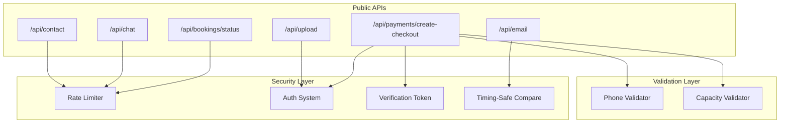

# Design Document: Public API Security Hardening

## Overview

This design addresses security vulnerabilities in public-facing APIs and the guest booking flow. The implementation focuses on:

1. **Rate Limiting**: Applying consistent rate limiting across all public endpoints using the centralized Rate_Limiter
2. **Authorization**: Ensuring proper access control for guest booking operations using verification tokens
3. **Input Validation**: Adding phone number and guest count validation
4. **Security Hardening**: Improving authentication for internal APIs and preventing timing attacks

The design leverages existing infrastructure (Rate_Limiter, Verification_Token system) while adding targeted enhancements.

## Architecture



## Components and Interfaces

### 1. Rate Limiting Integration

Each public endpoint will integrate with the existing `checkLimit` function from `lib/rate-limit`:

```typescript
// lib/rate-limit/index.ts (existing)
interface RateLimitOptions {
  limit?: number;
  windowMs?: number;
  keyPrefix?: string;
}

async function checkLimit(
  identifier: string,
  options: RateLimitOptions
): Promise<RateLimitResult>;
```

**Endpoint Configuration:**

| Endpoint | Key Prefix | Limit | Window |
|----------|------------|-------|--------|
| `/api/contact` | `contact-form` | 5 | 60s |
| `/api/chat` | `chat` | 10 | 60s |
| `/api/bookings/status` | `booking-status` | 10 | 60s |

### 2. Phone Number Validator

```typescript
// schemas/phone.ts
interface PhoneValidationResult {
  valid: boolean;
  normalized: string | null;
  error?: string;
}

function validatePhoneNumber(phone: string): PhoneValidationResult;
function normalizePhoneNumber(phone: string): string;
```

**Validation Rules:**
- Philippine mobile: `09XX-XXX-XXXX` or `+639XX-XXX-XXXX`
- Philippine landline: `(0XX) XXX-XXXX` or area code formats
- Strip non-numeric except leading `+`
- Minimum 10 digits, maximum 13 digits (with country code)

### 3. Guest Count Validator

```typescript
// lib/booking/capacity-validation.ts
interface CapacityValidationResult {
  valid: boolean;
  errors: CapacityError[];
}

interface CapacityError {
  roomId: string;
  roomName: string;
  capacity: number;
  requested: number;
}

function validateGuestCapacity(
  items: BookingItem[],
  rooms: Room[]
): CapacityValidationResult;
```

### 4. Guest Checkout Authorization

```typescript
// lib/booking/checkout-auth.ts
interface CheckoutAuthResult {
  authorized: boolean;
  reason?: string;
}

async function authorizeCheckout(
  bookingId: string,
  userId: string | null,
  verificationToken: string | null
): Promise<CheckoutAuthResult>;
```

**Authorization Flow:**
1. If user is logged in and owns the booking → Authorized
2. If verification token is valid and matches booking → Authorized
3. Otherwise → Unauthorized

### 5. Timing-Safe String Comparison

```typescript
// lib/security/timing-safe.ts
function timingSafeEqual(a: string, b: string): boolean;
```

Uses Node.js `crypto.timingSafeEqual` to prevent timing attacks on secret comparison.

### 6. Guest Cancellation Service

```typescript
// lib/booking/cancellation.ts
interface CancellationResult {
  success: boolean;
  refundAmount?: number;
  cancellationFee?: number;
  error?: string;
}

interface CancellationPolicy {
  freeCancellationHours: number;
  cancellationFeePercent: number;
}

async function cancelBooking(
  bookingId: string,
  verificationToken: string
): Promise<CancellationResult>;

function calculateCancellationFee(
  booking: Booking,
  policy: CancellationPolicy
): { refundAmount: number; fee: number };
```

## Data Models

### Phone Number Schema (Zod)

```typescript
const PhoneSchema = z.string()
  .transform(val => val.replace(/[^\d+]/g, ''))
  .refine(val => {
    // Philippine mobile: 09XXXXXXXXX or +639XXXXXXXXX
    const mobileRegex = /^(\+63|0)9\d{9}$/;
    // Philippine landline: 0XX-XXXXXXX or +632-XXXXXXX
    const landlineRegex = /^(\+63|0)[2-8]\d{7,8}$/;
    return mobileRegex.test(val) || landlineRegex.test(val);
  }, "Invalid Philippine phone number");
```

### Cancellation Record

The existing `Booking` model will be used with status updates:
- `CANCELLED` status for cancelled bookings
- `cancellationReason` field (optional, can be added if needed)

### Rate Limit Configuration

```typescript
const RATE_LIMIT_CONFIG = {
  'contact-form': { limit: 5, windowMs: 60000 },
  'chat': { limit: 10, windowMs: 60000 },
  'booking-status': { limit: 10, windowMs: 60000 },
  'booking-lookup': { limit: 5, windowMs: 60000 }, // existing
} as const;
```


## Correctness Properties

*A property is a characteristic or behavior that should hold true across all valid executions of a system—essentially, a formal statement about what the system should do. Properties serve as the bridge between human-readable specifications and machine-verifiable correctness guarantees.*

### Property 1: Phone Number Normalization Preserves Validity

*For any* valid Philippine phone number with formatting characters (spaces, dashes, parentheses), normalizing the number and then validating it SHALL produce the same validity result as validating the original.

**Validates: Requirements 7.5**

### Property 2: Valid Philippine Phone Formats Are Accepted

*For any* string matching Philippine mobile format (09XX-XXX-XXXX or +639XX-XXX-XXXX) or landline format with area code, the Phone_Validator SHALL return valid=true.

**Validates: Requirements 7.1, 7.2, 7.3**

### Property 3: Invalid Phone Formats Are Rejected

*For any* string that does not match any valid Philippine phone format (wrong length, invalid prefix, non-numeric characters in wrong positions), the Phone_Validator SHALL return valid=false.

**Validates: Requirements 7.4**

### Property 4: Checkout Authorization Requires Valid Token or Ownership

*For any* checkout request, authorization SHALL succeed if and only if:
- The user is logged in AND owns the booking, OR
- A valid, non-expired verification token is provided AND matches the booking

**Validates: Requirements 5.1, 5.2, 5.3, 5.4, 5.5**

### Property 5: Guest Count Cannot Exceed Room Capacity

*For any* booking with guest count G and room capacity C, if G > C then validation SHALL fail. If G <= C then validation SHALL pass (assuming other criteria are met).

**Validates: Requirements 8.1, 8.2**

### Property 6: Cancellation Fee Calculation Follows Policy

*For any* booking with check-in time T and cancellation time C:
- If (T - C) >= freeCancellationHours, refund SHALL equal 100% of booking amount
- If (T - C) < freeCancellationHours, refund SHALL equal (100 - cancellationFeePercent)% of booking amount

**Validates: Requirements 10.2, 10.3, 10.4**

### Property 7: Checked-In Bookings Cannot Be Cancelled

*For any* booking with status CHECKED_IN, cancellation requests SHALL be rejected regardless of token validity.

**Validates: Requirements 10.6**

### Property 8: Timing-Safe Comparison Returns Correct Result

*For any* two strings A and B, timingSafeEqual(A, B) SHALL return true if and only if A === B, while executing in constant time regardless of where strings differ.

**Validates: Requirements 9.2**

## Error Handling

### Rate Limiting Errors

| Scenario | HTTP Status | Response |
|----------|-------------|----------|
| Rate limit exceeded | 429 | `{ error: "Too many requests. Please try again in X seconds.", retryAfter: X }` |

### Authorization Errors

| Scenario | HTTP Status | Response |
|----------|-------------|----------|
| No auth token or session | 401 | `{ error: "Authentication required" }` |
| Expired verification token | 401 | `{ error: "This link has expired. Please use the booking lookup form." }` |
| Token doesn't match booking | 403 | `{ error: "Access denied" }` |
| User doesn't own booking | 403 | `{ error: "Access denied" }` |

### Validation Errors

| Scenario | HTTP Status | Response |
|----------|-------------|----------|
| Invalid phone number | 400 | `{ error: "Invalid phone number format", field: "phone" }` |
| Guest count exceeds capacity | 400 | `{ error: "Guest count exceeds room capacity", details: [...] }` |

### Cancellation Errors

| Scenario | HTTP Status | Response |
|----------|-------------|----------|
| Booking already checked in | 400 | `{ error: "Cannot cancel a booking that has already been checked in" }` |
| Booking already cancelled | 400 | `{ error: "This booking has already been cancelled" }` |
| Invalid token | 401 | `{ error: "Invalid or expired cancellation link" }` |

## Testing Strategy

### Unit Tests

Unit tests will cover:
- Phone number validation edge cases (empty string, too short, too long, invalid characters)
- Capacity validation with various room/guest combinations
- Cancellation fee calculation with boundary conditions
- IP extraction from various header combinations

### Property-Based Tests

Property-based tests using fast-check with minimum 100 iterations:

1. **Phone Validation Properties** (`schemas/__tests__/phone-validation.property.test.ts`)
   - Generate random valid phone formats → verify acceptance
   - Generate random invalid strings → verify rejection
   - Generate formatted numbers → verify normalization preserves validity

2. **Checkout Authorization Properties** (`lib/booking/__tests__/checkout-authorization.property.test.ts`)
   - Generate random booking/user/token combinations → verify authorization logic

3. **Capacity Validation Properties** (`lib/booking/__tests__/capacity-validation.property.test.ts`)
   - Generate random guest counts and room capacities → verify validation

4. **Cancellation Fee Properties** (`lib/booking/__tests__/cancellation-fee.property.test.ts`)
   - Generate random booking times and cancellation times → verify fee calculation

5. **Timing-Safe Comparison Properties** (`lib/security/__tests__/timing-safe.property.test.ts`)
   - Generate random string pairs → verify comparison correctness

### Integration Tests

Integration tests will verify:
- Rate limiting integration in each API endpoint
- End-to-end checkout flow with verification tokens
- Cancellation flow with email sending (mocked)

### Test Configuration

```typescript
// Property test configuration
const PBT_CONFIG = {
  numRuns: 100,
  seed: Date.now(), // For reproducibility in CI
};
```

Each property test will be tagged with:
```typescript
// Feature: public-api-security-hardening, Property N: [property description]
```
