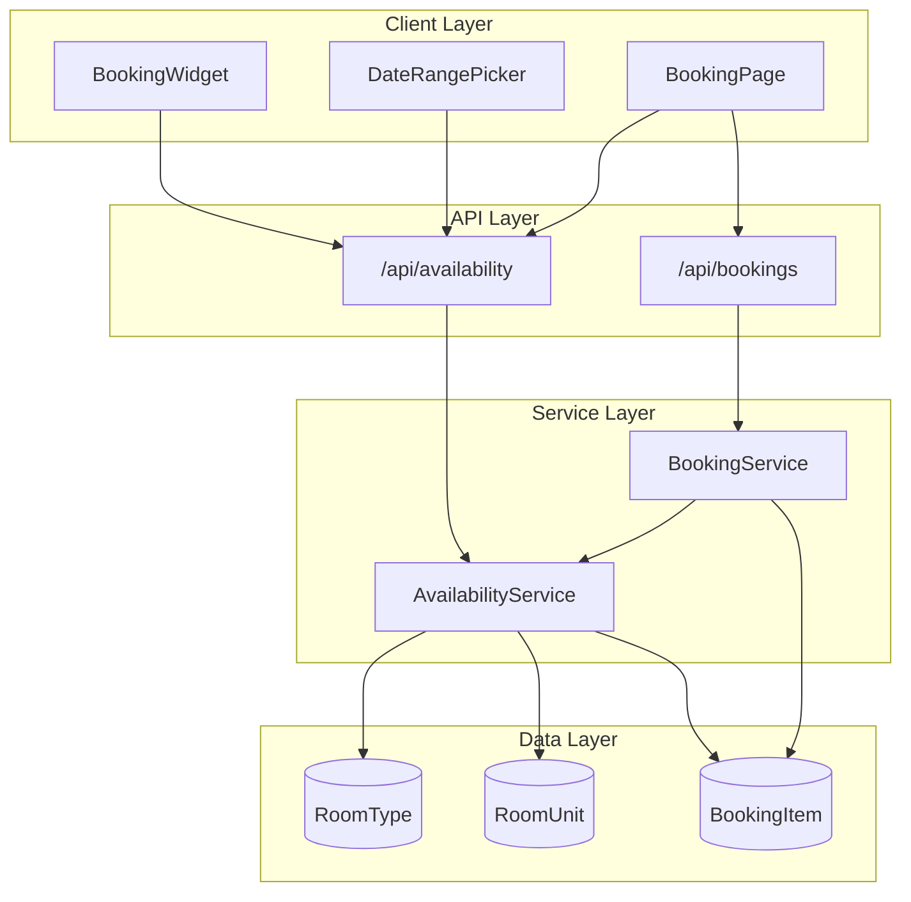

# Design Document: Unit-Based Room Availability

## Overview

This design enhances the room availability system to properly account for multiple room units per room type. The current system treats each room type as a single bookable entity, but hotels typically have multiple physical rooms (units) of the same type. This design introduces unit-aware availability checking that:

1. Counts available units per room type for any date range
2. Displays availability status in the calendar date picker
3. Shows accurate availability in the booking widget
4. Validates availability on the booking page
5. Prevents overselling through transactional booking creation

## Architecture



## Components and Interfaces

### 1. AvailabilityService (`lib/booking/availability.ts`)

Enhanced availability service with unit-based calculations.

```typescript
interface UnitAvailabilityCheck {
  roomTypeId: string;
  checkIn: Date;
  checkOut: Date;
}

interface UnitAvailabilityResult {
  roomTypeId: string;
  totalUnits: number;
  bookedUnits: number;
  availableUnits: number;
  available: boolean;
  limitedAvailability: boolean; // true if availableUnits <= 2
}

interface DateAvailability {
  date: Date;
  availableUnits: number;
  totalUnits: number;
  status: 'available' | 'limited' | 'unavailable';
}

// Check availability for a room type over a date range
async function checkUnitAvailability(
  checks: UnitAvailabilityCheck[]
): Promise<Map<string, UnitAvailabilityResult>>;

// Get daily availability for calendar display
async function getDateRangeAvailability(
  roomTypeId: string,
  startDate: Date,
  endDate: Date
): Promise<DateAvailability[]>;

// Check if a date range has any unavailable dates
function hasUnavailableDates(
  availability: DateAvailability[]
): boolean;
```

### 2. Availability API (`app/api/availability/route.ts`)

New API endpoint for fetching availability data.

```typescript
// GET /api/availability?roomTypeId=xxx&checkIn=xxx&checkOut=xxx
// Returns: UnitAvailabilityResult

// GET /api/availability/calendar?roomTypeId=xxx&month=2026-01
// Returns: DateAvailability[]

// POST /api/availability/bulk
// Body: { checks: UnitAvailabilityCheck[] }
// Returns: UnitAvailabilityResult[]
```

### 3. Enhanced DateRangePicker

Updated component with availability awareness.

```typescript
interface AvailabilityAwareDateRangePickerProps {
  date: DateRange | undefined;
  setDate: (date: DateRange | undefined) => void;
  roomTypeId?: string; // If provided, fetches availability
  disabledDates?: Date[]; // Dates with no availability
  limitedDates?: Date[]; // Dates with limited availability
  onAvailabilityLoad?: (availability: DateAvailability[]) => void;
}
```

### 4. Enhanced BookingWidget

Updated to show unit-based availability.

```typescript
interface RoomAvailability {
  roomId: string;
  roomName: string;
  roomImage: string;
  price: number;
  capacity: number;
  availableUnits: number;
  totalUnits: number;
  limitedAvailability: boolean;
}
```

## Data Models

### Existing Models (No Changes Required)

The current schema already supports unit-based availability:

```prisma
model Room {
  id        String     @id
  // ... other fields
  units     RoomUnit[] // Individual room units
  bookings  BookingItem[]
}

model RoomUnit {
  id         String   @id
  roomTypeId String
  roomType   Room     @relation(...)
  number     String   // "101", "102"
  isActive   Boolean  @default(true)
  // ...
  bookingItems BookingItem[]
}

model BookingItem {
  id         String    @id
  roomId     String    // Room type
  roomUnitId String?   // Specific unit (assigned at check-in)
  checkIn    DateTime
  checkOut   DateTime
  // ...
}
```

### Availability Calculation Logic

```
availableUnits = totalActiveUnits - overlappingBookings

where:
- totalActiveUnits = COUNT(RoomUnit WHERE roomTypeId = X AND isActive = true)
- overlappingBookings = COUNT(DISTINCT BookingItem WHERE 
    roomId = X AND 
    booking.status IN ('CONFIRMED', 'PENDING') AND
    checkIn < requestedCheckOut AND 
    checkOut > requestedCheckIn)
```

## Correctness Properties

*A property is a characteristic or behavior that should hold true across all valid executions of a system—essentially, a formal statement about what the system should do. Properties serve as the bridge between human-readable specifications and machine-verifiable correctness guarantees.*

### Property 1: Availability Calculation Correctness

*For any* room type with N active units and M overlapping bookings for a date range, the availability service SHALL return:
- `availableUnits = N - M`
- `available = (M < N)`
- `limitedAvailability = (N - M <= 2 AND N - M > 0)`

**Validates: Requirements 1.1, 1.3, 1.4, 1.5**

### Property 2: Date Overlap Detection Accuracy

*For any* two date ranges (checkIn1, checkOut1) and (checkIn2, checkOut2), they overlap if and only if `checkIn1 < checkOut2 AND checkOut1 > checkIn2`. The availability service SHALL correctly identify all and only overlapping bookings.

**Validates: Requirements 1.2**

### Property 3: Date Availability Classification

*For any* date and room type, the date SHALL be classified as:
- `unavailable` if availableUnits = 0
- `limited` if availableUnits > 0 AND availableUnits < (totalUnits * 0.5)
- `available` otherwise

And date range selection SHALL be blocked if any date in the range is `unavailable`.

**Validates: Requirements 2.2, 2.3, 2.4**

### Property 4: Room Type Display Filtering

*For any* property and date range, the booking widget SHALL display only room types where `availableUnits > 0`, and each displayed room type SHALL show the correct `availableUnits` count and `limitedAvailability` flag (true when availableUnits <= 2).

**Validates: Requirements 3.2, 3.3, 3.4**

### Property 5: Booking Validation Consistency

*For any* booking attempt where the selected room type has `availableUnits = 0` for the requested dates, the system SHALL reject the booking and display an error. In cart mode, each item SHALL be validated independently.

**Validates: Requirements 4.2, 4.4**

### Property 6: Concurrent Booking Protection

*For any* N concurrent booking attempts for a room type with M available units where N > M, exactly M bookings SHALL succeed and (N - M) SHALL fail with an availability error. No overselling SHALL occur.

**Validates: Requirements 5.2**

### Property 7: Cancellation Availability Release

*For any* confirmed booking that is cancelled, the availability for that room type and date range SHALL increase by 1 immediately after cancellation.

**Validates: Requirements 5.4**

## Error Handling

### Availability Errors

| Error Code | Description | User Message |
|------------|-------------|--------------|
| `ROOM_UNAVAILABLE` | No units available for dates | "This room type is fully booked for your selected dates" |
| `DATES_UNAVAILABLE` | Selected range includes unavailable dates | "Some dates in your selection are not available" |
| `AVAILABILITY_CHANGED` | Availability changed during booking | "Sorry, this room was just booked. Please select different dates." |

### API Error Responses

```typescript
interface AvailabilityError {
  code: string;
  message: string;
  availableAlternatives?: {
    roomTypeId: string;
    roomName: string;
    availableUnits: number;
  }[];
}
```

## Testing Strategy

### Unit Tests

1. **Availability calculation** - Test with various unit counts and booking scenarios
2. **Date overlap detection** - Test edge cases (same day, adjacent days, partial overlap)
3. **Classification logic** - Test threshold calculations for limited/unavailable

### Property-Based Tests (fast-check, minimum 100 iterations)

1. **Property 1**: Generate random room types with random unit counts and bookings, verify availability calculation
2. **Property 2**: Generate random date ranges, verify overlap detection matches mathematical definition
3. **Property 3**: Generate random availability data, verify classification matches rules
4. **Property 4**: Generate random property data, verify filtering logic
5. **Property 5**: Generate booking attempts with various availability states, verify validation
6. **Property 6**: Simulate concurrent bookings, verify no overselling
7. **Property 7**: Generate bookings and cancellations, verify availability updates

### Integration Tests

1. **API endpoint tests** - Verify correct responses for various scenarios
2. **Component tests** - Verify DateRangePicker and BookingWidget display correct availability
3. **End-to-end booking flow** - Verify complete booking process with availability checks
